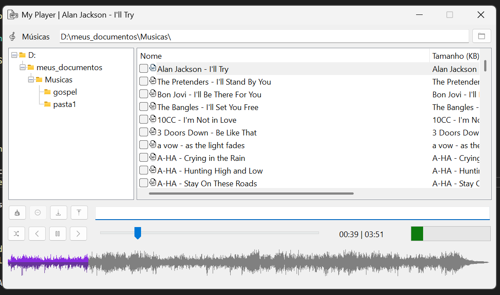

# My Player

Player de música em C# utilizando NAudio

# Motivação

O principal motivo do desenvolvimento desse player foi a execução "aleatória" de músicas de uma playlist. Aparentemente os players que testei tendem a reproduzir as mesmas músicas, mesmo habilitando a função random. Esse sentimento é partilhado por outras pessoas com quem conversei.

Cheguei a desenvolver um algoritmo de embaralhamento de músicas e um programa que testa a distribuição e colisões de escolha. Infelizmente perdi o código do mesmo. Para esse projeto o algoritmo de [Fisher–Yates](https://en-wikipedia-org.translate.goog/wiki/Fisher%E2%80%93Yates_shuffle?_x_tr_sl=en&_x_tr_tl=pt&_x_tr_hl=pt&_x_tr_pto=tc) mostrou-se satisfatório.

Sua implementação está na classe `MyPlayer.classes.util.Util`, método `public static List<ListViewItem>? Shuffle(List<ListViewItem> list)`.

Neste projeto - estudo de:

1. lib NAudio
2. controle de estados de um player: início, pause, continue, scroll music

A "onda" que representa a execução das músicas está na classe `MyPlayer.classes.waveimage.WaveImage`, ver [NAudio.WaveFormRenderer](https://github.com/naudio/NAudio.WaveFormRenderer/tree/master).

# Libs

`dotnet add package NAudio`

# TODO

- [X] controle de estados simples
- [ ] filtros
- [ ] estado treeview
- [X] permitir adicionar várias pastas
- [X] salvar / abrir playlist
- [ ] botões para primeira e última música ?
- [ ] dark theme ?

# Urls

- [Fisher–Yates](https://en-wikipedia-org.translate.goog/wiki/Fisher%E2%80%93Yates_shuffle?_x_tr_sl=en&_x_tr_tl=pt&_x_tr_hl=pt&_x_tr_pto=tc)
- [NAudio.WaveFormRenderer](https://github.com/naudio/NAudio.WaveFormRenderer/tree/master)
- [icons8](https://icons8.com/)
